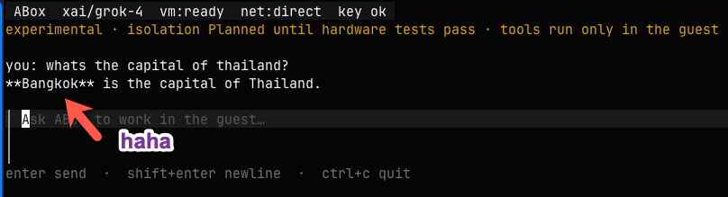

# ABox

Terminal-native coding-agent harness. The agent — prompts, model calls, and
tools — runs inside a libkrun microVM. The host is the TUI and VMM.

<p align="center">
  
</p>

<p align="center">
  <a href="https://github.com/AdminTurnedDevOps/ABox"></a>
  <a href="LICENSE"></a>
  <a href="go.mod"></a>
  <a href="PLAN.md"></a>
</p>

<p align="center">
  <a href="#quickstart">Quick Start</a> ·
  <a href="PLAN.md">Plan</a> ·
  <a href="LICENSE">License</a>
</p>

**Status:** experimental. Isolation is **Planned** until hardware acceptance
tests pass. Runnable today: guest agent (prompt, model call, tools) in a
libkrun microVM on Apple Silicon, plus TUI and `/provider`.

## Prerequisites

- Apple Silicon Mac
- Go 1.24+
- Docker (to pack the guest disk)
- libkrun and libkrunfw

```bash
brew tap libkrun/krun
brew trust libkrun/krun
brew install libkrun libkrunfw
```

Confirm `kern.hv_support` is `1`.

## Quickstart

From this repo (or any directory). If Git is missing, dirty, or has no
commits, ABox copies the files into a private snapshot and leaves your
host Git alone.

```bash
make build
make image
export PATH="$PWD/bin:$PATH"
export XAI_API_KEY=...          # or OPENAI_API_KEY / ANTHROPIC_API_KEY
abox
```

- `enter` sends a prompt (`shift+enter` / `alt+enter` for a new line)
- `/provider` sets Grok, OpenAI, or Anthropic API keys
- `ctrl+c` quits
- The agent runs only inside the guest

## Test

Open `abox`

Send any prompt.

Example:



## Choose Provider

Currently, Grok, OpenAI, and Anthropic are supported.


## Without Key

Prove the microVM without a model key:

```bash
abox --probe-vm
```

Headless agent loop:

```bash
abox exec --prompt "list the repository files"
```

Skip the VM (tools fail closed; useful for UI-only checks):

```bash
abox --no-vm
```

## What is not done yet

MCP, compaction, checkpoint/rollback/fork, agentgateway, and resource
acceptance. See `PLAN.md`.

## Security

Do not describe this build as verified isolation. The device plan is
allowlisted (no guest NIC, no host-path virtio-fs, TSI flags zero). Claims
stay Planned until the hardware suite in `PLAN.md` §21.4 passes.

## Whats Currently In Place

```
┌──────────────────┬──────────────────────────────────────────────────────────────────────┐
│ Area             │ State                                                                │
├──────────────────┼──────────────────────────────────────────────────────────────────────┤
│ Agent loop       │ In the guest. Host is TUI + VMM.                                     │
├──────────────────┼──────────────────────────────────────────────────────────────────────┤
│ MicroVM boot     │ libkrun 1.19.4, raw disks, vsock, abox-vmm                           │
├──────────────────┼──────────────────────────────────────────────────────────────────────┤
│ Five tools       │ list_files, read_file, search, apply_patch, run_command in guest     │
├──────────────────┼──────────────────────────────────────────────────────────────────────┤
│ Repo snapshot    │ Copied into guest (clean tree or ephemeral)                          │
├──────────────────┼──────────────────────────────────────────────────────────────────────┤
│ Providers        │ Grok/OpenAI (chat completions) + Anthropic Messages. /provider keys. │
├──────────────────┼──────────────────────────────────────────────────────────────────────┤
│ LLM egress       │ Allowlist: api.x.ai, api.openai.com, api.anthropic.com via TSI inet  │
├──────────────────┼──────────────────────────────────────────────────────────────────────┤
│ TUI              │ Dark full-screen, Enter to send, /provider                           │
├──────────────────┼──────────────────────────────────────────────────────────────────────┤
│ Headless         │ abox exec, --probe-vm                                                │
├──────────────────┼──────────────────────────────────────────────────────────────────────┤
│ License / module │ Apache-2.0, github.com/AdminTurnedDevOps/ABox                        │
```

## Whats Left To Do

Harness (PLAN §1 / §12)
• Context accounting and compaction
• AGENTS.md / skills
• Persistent sessions, resume, inspectable memory
• Approval workflows (run_command and MCP should prompt; they do not)
• Patch review TUI and host import (export exists in guest; no review/import)

MCP and connectivity
• Guest MCP client (stdio + brokered HTTP/SSE)
• Host connectivity broker (typed, no raw URLs)
• Package origin-rewrite (npm/pip/cargo/Go)
• Optional agentgateway adapter (fail-closed)

Runtime
• Cold checkpoint, rollback, fork (quiesce ioctl exists; no lineage/UI)
• Idle-stop / resume / preserve
• Image manifest + SHA-256 verify
• VMM liveness pipe, stale-PID cleanup
• Orderly shutdown via krun_get_shutdown_eventfd
• Device-plan unit tests; hardware canary suite (§21.4 / §22)
• Resource budgets and named-machine benches

Providers (as specified)
• OpenAI/xAI Responses API (you have Chat Completions)
• httptest fixtures for stream/tool/error cases
• Server-side provider tools explicitly disabled and tested

Docs / Phase 0 leftovers
• docs/architecture.md, threat model, ADRs, roadmap
• Phase 0.5 spike recorded as Planned vs verified
• PLAN still says “no TSI” in one table and “TSI inet for HTTPS” in another — needs a single decision
