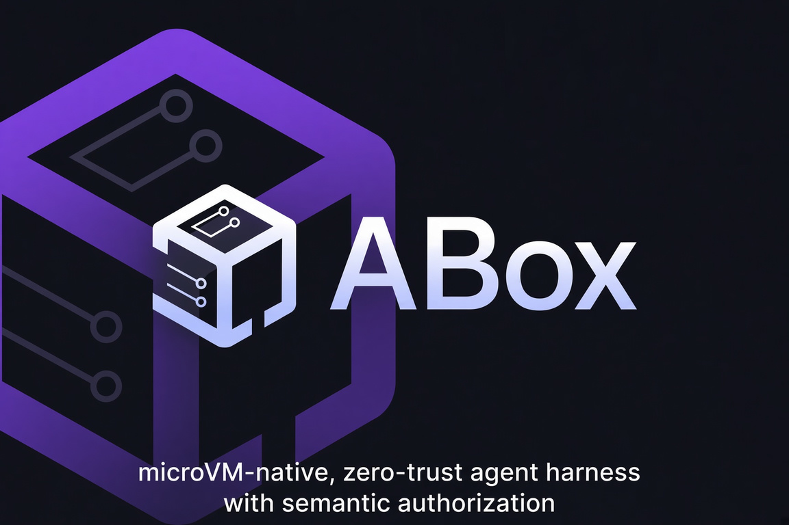
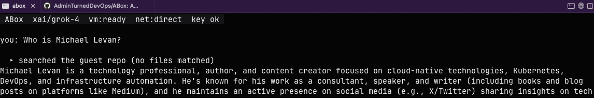
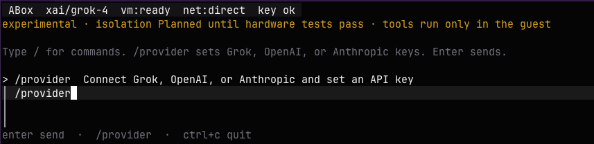
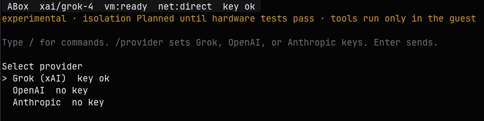

# ABox

An always-on, isolated agent harness.

The agent, prompts, model calls, and tools runs in isolation.

<p align="center">
  
</p>

<p align="center">
  <a href="https://github.com/AdminTurnedDevOps/ABox"></a>
  <a href="LICENSE"></a>
  <a href="go.mod"></a>
  <a href="PLAN.md"></a>
</p>

<p align="center">
  <a href="#quickstart">Quick Start</a> ·
  <a href="PLAN.md">Plan</a> ·
  <a href="LICENSE">License</a>
</p>

Right now, the industry is incredibly focused on agent sandboxes for production (servers, cloud, Kubernetes, etc), but the biggest security entry point are agents running locally on someone’s laptop.

**Status:** experimental. Runnable today: guest agent (prompt, model call, tools) in a
libkrun microVM on Apple Silicon, plus TUI and `/provider`.

## Prerequisites

- Apple Silicon Mac
- Go 1.24+
- Docker (to pack the guest disk)
- libkrun and libkrunfw

```bash
brew tap libkrun/krun
brew trust libkrun/krun
brew install libkrun libkrunfw
```

Confirm `kern.hv_support` is `1`.

## microVM > Docker

`abox` does not run the agent in Docker. A session is a **libkrun microVM**:
a Linux kernel and `abox-guest` on Apple Hypervisor.framework. The guest
repo is a copy of your files on that VM disk, not a container mount.

Docker is used only when you pack the guest disk (`make image` /
`make image-update`). After that, ABox boots the raw image with libkrun.
No Docker daemon is on the session path.

| Step | What runs |
| --- | --- |
| `make image` | Docker, to build the guest disk |
| `abox` / `--probe-vm` | `abox` + `abox-vmm` + libkrun VM |

`~/.abox/images/abox-guest.raw` is the **base guest disk**
(Alpine + git + `abox-guest`). Think of it like the microVMs golden hard-drive image. Sessions do not boot that file read/write.
On start, ABox clones it (APFS copy-on-write when available) to:

`~/.abox/sessions/<session-id>/root.raw`

The microVM attaches that session disk. Repo snapshot and agent work land
there. The cache image stays the clean template for the next session.

Each session also gets a small read-only `config.raw` (session id,
capability, model, keys). That is not the OS disk.

## Quickstart

From this repo (or any directory). If Git is missing, dirty, or has no
commits, ABox copies the files into a private snapshot and leaves your
host Git alone.

`make image`: uses Docker once to pack a raw Alpine disk (`~/.abox/images/abox-guest.raw` - the golden HD): base OS, git, patch, and abox-guest. Needed the first time, or when you want a full disk rebuild. Depends on `make guest`.

`make build` compiles the three binaries into bin/:
- `abox`: host TUI
- abox-vmm: libkrun helper (codesigned for Hypervisor.framework)
- abox-guest-linux-arm64: Linux agent, built for the VM (GOOS=linux GOARCH=arm64)

```bash
make build
make image
export PATH="$PWD/bin:$PATH"
abox
```

- `/provider` sets Grok, OpenAI, or Anthropic API keys
- `/mcp` lists configured Streamable HTTP MCP servers and accepts a Bearer token (`abox mcp login` for OAuth)
- `ctrl+c` quits
- The agent runs only inside the guest (MicroVM)

## Test

1. Open `abox` on any terminal

2. Send any prompt.

Example:



## Choose Provider

Currently, Grok, OpenAI, and Anthropic are supported.




## Test MicroVM Connectivity

Prove the MicroVM is up without an LLM key (boots the guest and lists files):

```bash
abox --probe-vm
```

You'll see an output similar to the below from the guest disk via `list_files` over `vsock` (virtual socket between the host and the guest/MicroVM)

```
❯ abox --probe-vm
guest ready; files:
.git
.git/COMMIT_EDITMSG
.git/HEAD
.git/branches
.git/config
.git/description
.git/hooks
.git/hooks/applypatch-msg.sample
.git/hooks/commit-msg.sample
.git/hooks/post-update.sample
.git/hooks/pre-applypatch.sample
.git/hooks/pre-commit.sample
.git/hooks/pre-merge-commit.sample
.git/hooks/pre-push.sample
.git/hooks/pre-rebase.sample
.git/hooks/pre-receive.sample
.git/hooks/prepare-commit-msg.sample
.git/hooks/push-to-checkout.sample
.git/hooks/sendemail-validate.sample
.git/hooks/update.sample
.git/index
.git/info
.git/info/exclude
.git/logs
.git/logs/HEAD
.git/logs/refs
.git/logs/refs/heads
.git/objects
.git/objects/00
.git/objects/00/e0123951d8bb668e109e33b4df3415b2cfdb90
.git/objects/03
.git/objects/03/3b6a40f1400fe5d2998486dc2be99e08c31820
.git/objects/04
.git/objects/04/0f99ac609f8a6e9b85905747542db5f56d6dcc
.git/objects/0e
.git/objects/0e/8d0f06e0cab265dfd884b7b5ebb4caaffdc0cf
.git/objects/0e/ef0707995b2673d37f94d03334e54332408ada
.git/objects/0f
.git/objects/0f/562f65d5ec3c4323fab8f9acfe711044394fcc
.git/objects/13
.git/objects/13/deeea53575596cb72d6e121741dd1354760c2c
.git/objects/13/f6342f8ded5877c8e174fb0a90a1a5038799ad
.git/objects/19
.git/objects/19/4c7e69fab6609d2b65378a27f2f4c1aa8eaade
.git/objects/19/e57d672990c73b0f2e80c68d6f9e970c6bfe7d
.git/objects/1a
.git/objects/1a/9d23508b4ff4c817893fc191fdbcb91eb2a456
.git/objects/1e
.git/objects/1e/c66cc8956194fe8feedbb4915fb9ea45ec8c9d
.git/objects/20
```

Headless agent loop (needs a VM and a provider key; the prompt is sent to the guest agent):

```bash
abox exec --prompt "list the repository files"
```

Open the TUI without a VM. The agent will not run; `/provider` still works:

```bash
abox --no-vm
```

## LLM Integration

## MCP Integration

ABox is an MCP **client**. Remote tools are Streamable HTTP. Stdio MCP is not implemented.

Much like the LLM integration, you need the ability to control, secure, govern, MCP, along with isolate what MCP Servers can be used. That's why `Streamable HTTP` makes the most sense.

```go
type StreamableClientTransport struct {
    Endpoint   string       // The target MCP server HTTP URL
    HTTPClient *http.Client // The underlying client used for requests
    MaxRetries int          // Configuration for request/replay retryability
}
```

`StreamableClientTransport` is the best choice for this architectural setup as when running an AI agent inside an isolated sandbox (e.g., microVM), the sandbox itself becomes part of your security trust boundary.


Config lives at `~/.abox/config.yaml` (same pattern as `~/.claude`, `~/.codex`). First `abox` run creates `~/.abox/` (mode 0700) and a default `config.yaml` if they are missing. Credentials are `~/.abox/credentials.env`.

Add a Streamable HTTP server without editing YAML by hand. `--mode` is required:

```bash
# Direct: ABox dials the server. Token optional.
abox mcp add --mode direct --credential-env GITHUB_MCP_TOKEN github https://api.githubcopilot.com/mcp/

# Agentgateway: ABox dials the gateway only. No token; auth is on the gateway.
abox mcp add --mode agentgateway agw https://agw.example/mcp
```

`abox mcp login <name>` runs host OAuth (or saves a PAT) for a server that already exists in config. `/mcp` in the TUI pastes a Bearer for a configured server.

One guest client. Every remote MCP is a Streamable HTTP `url`. Direct GitHub and an agentgateway virtual MCP are the same field; only `connectivity.mode` changes the policy. `credential_env` is optional (omit when the server needs no Bearer).

- `direct` — guest may dial every `mcp_servers` URL.
- `agentgateway` — those URLs are the gateway (typically one). Bind GitHub, Atlassian, and the rest **on the gateway**, not as extra ABox origins. ABox does not install the gateway; binary, Docker, or Kubernetes all work. `enforcement: required` means exactly one `mcp_servers` entry.
- `offline` — no remote MCP.

**Direct mode** — guest dials each configured HTTPS MCP server:

```yaml
connectivity:
  mode: direct

mcp_servers:
  - name: github
    url: https://api.githubcopilot.com/mcp/
    credential_env: GITHUB_MCP_TOKEN
```

**Agentgateway mode** — same `url` field, pointing at the gateway MCP endpoint. No gateway token:

```yaml
connectivity:
  mode: agentgateway
  enforcement: required

mcp_servers:
  - name: agw
    url: https://agw.example/mcp
```

There is no protocol difference. Same guest client, same Streamable HTTP, same url: field. https://api.githubcopilot.com/mcp/ and https://agw.example/mcp are the same kind of thing.

What differs is who is allowed to be an origin.

1. direct: the guest may dial every URL you list. GitHub itself, an agentgateway, both, whatever. Auth is per entry (credential_env optional).
2. agentgateway + required: config load fails if you list more than one URL. The guest’s allowlist is only that host. Copilot/Atlassian/etc. are bound on the gateway, not as extra ABox origins. That is the fail-closed PLAN rule: no silent fallback to api.githubcopilot.com.

And this brings a huge difference which, with direct mode, you need to pass in a token/auth. With agentgateway mode, you handle OAuth/token Exchange/OBO via agentgateway policies, governance, and security implementations.


## Why?

A few reasons...

**First, why not just use the Docker Sandbox?**

The thought of "why not just use Docker Sandbox instead?" came to mind when I was building this out.

Here are a few reasons why:

It spins up the Docker engine inside of the sandbox vs just using microvm
Its not a harness or an Agent, its the infrastructure runtime layer
You'd put your agent harness INSIDE of the Docker Agent
When thinking about these things, I began to imagine the constraint on resources locally and the extra hops it would take to hit your actual Agent vs having a Harness thats sandboxed-out-of-the-box (that sounds cool... I'll have to steal it from myself).

These aren't inherently "bad things". I'm just thinking to myself as I'm building out the solution "I want to be as close to the MicroVM as possible. I don't want additional hops where things can break out and go wrong. I want isolation at its purest form".

**Second, why Go?**

If you look at Harnesses, they're written in a few different languages:

- Go
- TS
- Rust

and when thinking about what language to write a Harness in, you should think about:

- Harness is I/O-bound glue. Every meaningful latency cost is the model generating tokens over the wire. Whether your event loop dispatches a tool call in 5ms or 50ms is invisible next to a 4-second streaming response
- Distribution of the Harness. A Go or Rust binary means no runtime, no version conflicts, and it drops cleanly into containers, CI runners, and locked-down environments.
- Startup time
- Concurrency for paralell sub-agents
- Fast startup that doesn't undo Firecracker's boot time.
- Goroutines that fit process supervision and fan-out across VMs.

Because of the above, Go or Rust are naturally great languages. Because I like Go, I went with Go. No other reason as it would've been perfectly suitable in Rust. I might even have an Agent do a Rust version for comparison at some point.

<<<<<<< HEAD
## What is not done yet

Compaction, checkpoint/rollback/fork, stdio MCP, host broker, and resource
acceptance. See `PLAN.md`. Streamable HTTP MCP is in; isolation stays Planned.

## Security

Do not describe this build as verified isolation. The device plan is
allowlisted (no guest NIC, no host-path virtio-fs, TSI flags zero). Claims
stay Planned until the hardware suite in `PLAN.md` §21.4 passes.

=======
>>>>>>> 6cedf71a1b349b246aea20d467b0851db8030a45
## Whats Currently In Place

```
┌──────────────────┬──────────────────────────────────────────────────────────────────────┐
│ Area             │ State                                                                │
├──────────────────┼──────────────────────────────────────────────────────────────────────┤
│ Agent loop       │ In the guest. Host is TUI + VMM.                                     │
├──────────────────┼──────────────────────────────────────────────────────────────────────┤
│ MicroVM boot     │ libkrun 1.19.4, raw disks, vsock, abox-vmm                           │
├──────────────────┼──────────────────────────────────────────────────────────────────────┤
│ Five tools       │ list_files, read_file, search, apply_patch, run_command in guest     │
├──────────────────┼──────────────────────────────────────────────────────────────────────┤
│ Repo snapshot    │ Copied into guest (clean tree or ephemeral)                          │
├──────────────────┼──────────────────────────────────────────────────────────────────────┤
│ Providers        │ Grok/OpenAI (chat completions) + Anthropic Messages. /provider keys. │
├──────────────────┼──────────────────────────────────────────────────────────────────────┤
│ LLM egress       │ Allowlist: api.x.ai, api.openai.com, api.anthropic.com via TSI inet  │
├──────────────────┼──────────────────────────────────────────────────────────────────────┤
│ MCP              │ Guest Streamable HTTP client; direct URLs or exclusive agentgateway  │
├──────────────────┼──────────────────────────────────────────────────────────────────────┤
│ TUI              │ Dark full-screen, Enter to send, /provider, /mcp                     │
├──────────────────┼──────────────────────────────────────────────────────────────────────┤
│ Headless         │ abox exec, --probe-vm                                                │
├──────────────────┼──────────────────────────────────────────────────────────────────────┤
│ License / module │ Apache-2.0, github.com/AdminTurnedDevOps/ABox                        │
```

## Whats Left To Do

Harness (PLAN §1 / §12)
• Context accounting and compaction
• AGENTS.md / skills
• Persistent sessions, resume, inspectable memory
• Approval workflows (run_command and MCP should prompt; they do not)
• Patch review TUI and host import (export exists in guest; no review/import)

MCP and connectivity
• Stdio MCP, host byte-broker, origin-rewrite
• CIMD / client-credentials OAuth
• MCP resources, prompts, elicitation
• Per-tool approval UI

Runtime
• Cold checkpoint, rollback, fork (quiesce ioctl exists; no lineage/UI)
• Idle-stop / resume / preserve
• Image manifest + SHA-256 verify
• VMM liveness pipe, stale-PID cleanup
• Orderly shutdown via krun_get_shutdown_eventfd
• Device-plan unit tests; hardware canary suite (§21.4 / §22)
• Resource budgets and named-machine benches

Providers (as specified)
• OpenAI/xAI Responses API (you have Chat Completions)
• httptest fixtures for stream/tool/error cases
• Server-side provider tools explicitly disabled and tested

Docs / Phase 0 leftovers
• docs/architecture.md, threat model, ADRs, roadmap
• Phase 0.5 spike recorded as Planned vs verified
• PLAN still says “no TSI” in one table and “TSI inet for HTTPS” in another — needs a single decision
