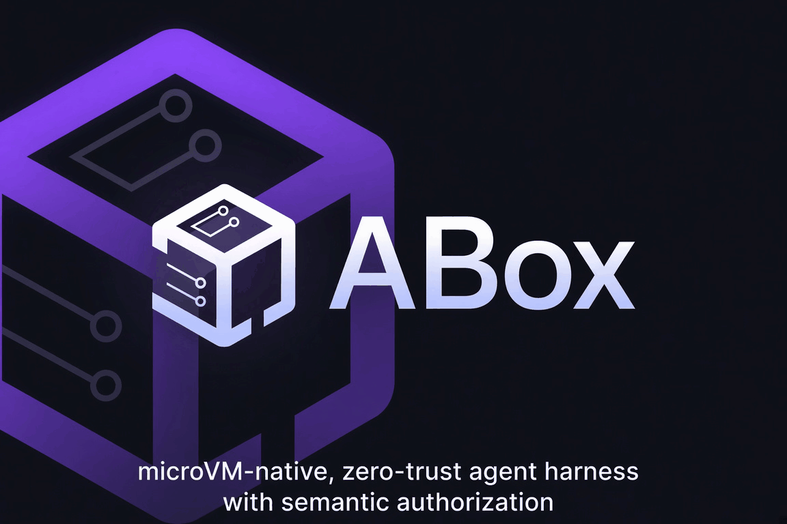
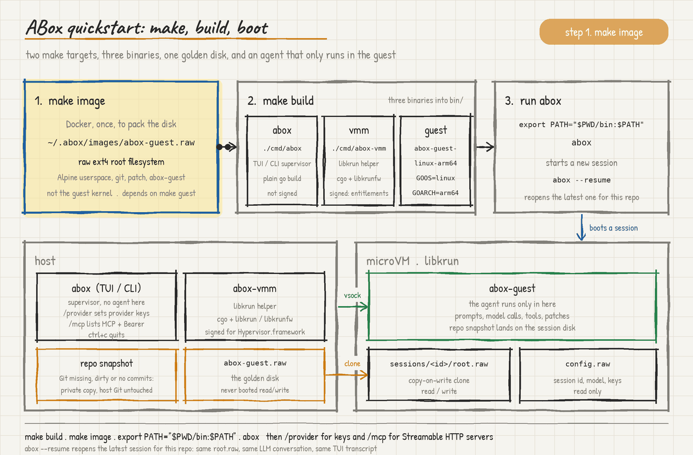
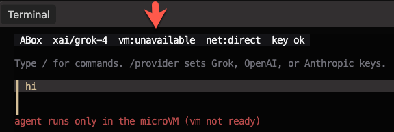
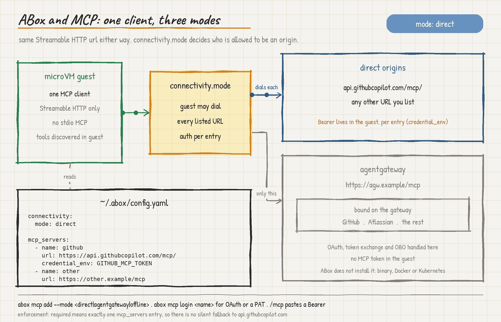

# ABox

An always-on, isolated agent harness.

The agent, prompts, model calls, and tools runs in isolation.

<p align="center">
  
</p>

<p align="center">
  <a href="https://github.com/AdminTurnedDevOps/ABox"></a>
  <a href="LICENSE"></a>
  <a href="go.mod"></a>
  <a href="PLAN.md"></a>
</p>

<p align="center">
  <a href="#quickstart">Quick Start</a> ·
  <a href="https://adminturneddevops.github.io/ABox/">Docs</a> ·
  <a href="PLAN.md">Plan</a> ·
  <a href="LICENSE">License</a>
</p>

Right now, the industry is incredibly focused on agent sandboxes for production (servers, cloud, Kubernetes, etc), but the biggest security entry point are agents running locally on someone’s laptop.

**Status:** experimental. Runnable today: guest agent (prompt, tools) in a
libkrun microVM on Apple Silicon; host TUI/SDK, LLM/MCP brokers, and
`run_command` approval. Protocol 4.

## Prerequisites

- Apple Silicon Mac
- Go 1.24+
- Docker (today: pack the guest **root filesystem** image only; not on the session path)
- libkrun and libkrunfw (VMM + **guest Linux kernel**; the kernel is not inside the `.raw` disk)

```bash
brew tap libkrun/krun
brew trust libkrun/krun
brew install libkrun libkrunfw
```

## Quickstart

From this directory or any other directory. ABox snapshots that exact directory
without inspecting host Git state. `.git` metadata is excluded; the guest
creates its own private baseline for change tracking.

Git ignore rules are not consulted. Every regular file beneath the selected
directory is copied, including dotfiles, except `.git` metadata. Start ABox
from a directory containing only files the guest is allowed to read.



`make image`: uses Docker once (today) to pack a raw ext4 root filesystem
(`~/.abox/images/abox-guest.raw`): Alpine userspace, git, patch, and
abox-guest. Not the guest kernel. Needed the first time, or when you want a
full disk rebuild. Depends on `make guest`.

`make build` compiles the three binaries into `bin/` (`abox`, `vmm`, and `guest`):

| | `abox` | `vmm` |
| --- | --- | --- |
| Package | `./cmd/abox` | `./cmd/abox-vmm` |
| Binary | TUI / CLI (supervisor) | libkrun helper |
| Build | plain `go build` | cgo + libkrun/libkrunfw (Apple Silicon) |
| Sign | no | yes — Hypervisor.framework entitlements |

`guest` is `abox-guest-linux-arm64`: Linux agent, built for the VM (`GOOS=linux GOARCH=arm64`).

```bash
make build
make image
export PATH="$PWD/bin:$PATH"
abox
```

- `/provider` sets Grok, OpenAI, or Anthropic API keys
- `/credential` points a model at Vault, Azure Key Vault, or AWS Secrets Manager
- `/mcp` lists configured Streamable HTTP MCP servers and accepts a Bearer token (`abox mcp login` for OAuth)
- `/help` lists slash commands
- Model-authored `run_command` opens an approval prompt (deny is the default)
- `abox --resume <id>` reopens that session's `root.raw`, LLM conversation, and TUI transcript. Plain `abox` starts a new session and prints its id.
- `ctrl+c` quits
- The agent runs only inside the guest (MicroVM)


## microVM > Docker

`abox` does not run the agent in Docker. A session is a **libkrun microVM**:
Linux kernel + `abox-guest` on Apple Hypervisor.framework. The guest repo is
a copy of your files on that VM disk, not a container mount.

### Kernel vs disk

The `.raw` file is **only a disk**: a 768 MiB ext4 **root filesystem**
(userspace). Alpine base, `git`, `patch`, `/usr/local/bin/abox-guest`. No
kernel, no bootloader, no hypervisor.

The guest kernel comes from **libkrunfw** (Homebrew), not from that disk.
`abox-vmm` links libkrun + libkrunfw, starts the VM, then attaches host files
as virtio-blk:

```text
abox
  → abox-vmm
      → libkrun (userspace VMM)
      → libkrunfw          ← Linux kernel
      → Hypervisor.framework
      → ARM virtualization

host:  ~/.abox/sessions/<id>/root.raw     ordinary Mac file (ext4)
         ↓ libkrun virtio-blk
guest: /dev/vda                           block device
         ↓ kernel mounts ext4 as /
guest: /                                  Alpine + abox-guest + /work/repo

host:  ~/.abox/sessions/<id>/config.raw   second file, read-only
         ↓
guest: /dev/vdb                           session id + model alias (no secrets)
```

Swap the `.raw` and you change userspace. Swap libkrunfw and you change the
guest kernel.

### Docker packs that filesystem (today)

Docker is only the packer: a privileged container runs `apk` and `mkfs.ext4`
because a Mac cannot build that ARM64 ext4 tree itself. Session boot does not
use Docker. Replacing this packer is follow-up work.

| Step | What runs |
| --- | --- |
| `make image` | Docker, to pack the golden **root filesystem** (ext4 `.raw`) |
| `make image-update` | Docker, to replace `/usr/local/bin/abox-guest` on that `.raw` |
| `abox` / `--probe-vm` | `abox` + `abox-vmm` + libkrun + libkrunfw. No Docker. |

1. Golden image — ~/.abox/images/abox-guest.raw
Packed once (make image). Alpine + git + patch + abox-guest. Template only. Not attached to a running VM.

2. Session hard disk — ~/.abox/sessions/<id>/root.raw
Clone of (1) for that run. This is /dev/vda → /. Repo, guest Git, agent writes. Destroy the session dir and this disk is gone; the golden stays.

ABox does not boot (1). It copies (1) → (2), then the microVM uses (2). --resume skips the copy and boots the existing (2).

3. Config disk — sessions/<id>/config.raw
~1 MiB, read-only /dev/vdb. Session id and model alias. No API keys, no MCP URLs. Not cloned from the golden image, not an OS. It lives inside of the directory where your sandbox harness session lives.

The VM boots **only** the session clone, not the golden file. Destroy a session directory and that run’s guest files are gone; the golden image stays clean for the next `abox`. `make image-update` patches `/usr/local/bin/abox-guest` on an existing golden disk; `make image` rebuilds the golden disk from scratch.

### Resume Command

`abox --resume <id>` does **not** clone the golden image again. It boots that
session's existing `root.raw`, and the guest reloads conversation state from
`/var/lib/abox/context.json` on that disk. The TUI reloads the same transcript
(host `transcript.json`, or the guest context if that file is missing). The
host source directory is not copied again.

## Test

1. Open `abox` on any terminal

2. Send any prompt.

Example:


## Choose Provider

Currently, Grok, OpenAI, and Anthropic are supported.


## Test MicroVM Connectivity

Prove the MicroVM is up without an LLM key (boots the guest and lists files):

```bash
abox --probe-vm
```

You'll see an output similar to the below from the guest disk via `list_files` over `vsock` (virtual socket between the host and the guest/MicroVM)

```
❯ abox --probe-vm
guest ready; files:
.git
.git/COMMIT_EDITMSG
.git/HEAD
.git/branches
.git/config
.git/description
.git/hooks
.git/hooks/applypatch-msg.sample
.git/hooks/commit-msg.sample
.git/hooks/post-update.sample
.git/hooks/pre-applypatch.sample
.git/hooks/pre-commit.sample
.git/hooks/pre-merge-commit.sample
.git/hooks/pre-push.sample
.git/hooks/pre-rebase.sample
.git/hooks/pre-receive.sample
.git/hooks/prepare-commit-msg.sample
.git/hooks/push-to-checkout.sample
.git/hooks/sendemail-validate.sample
.git/hooks/update.sample
.git/index
.git/info
.git/info/exclude
.git/logs
.git/logs/HEAD
.git/logs/refs
.git/logs/refs/heads
.git/objects
.git/objects/00
.git/objects/00/e0123951d8bb668e109e33b4df3415b2cfdb90
.git/objects/03
.git/objects/03/3b6a40f1400fe5d2998486dc2be99e08c31820
.git/objects/04
.git/objects/04/0f99ac609f8a6e9b85905747542db5f56d6dcc
.git/objects/0e
.git/objects/0e/8d0f06e0cab265dfd884b7b5ebb4caaffdc0cf
.git/objects/0e/ef0707995b2673d37f94d03334e54332408ada
.git/objects/0f
.git/objects/0f/562f65d5ec3c4323fab8f9acfe711044394fcc
.git/objects/13
.git/objects/13/deeea53575596cb72d6e121741dd1354760c2c
.git/objects/13/f6342f8ded5877c8e174fb0a90a1a5038799ad
.git/objects/19
.git/objects/19/4c7e69fab6609d2b65378a27f2f4c1aa8eaade
.git/objects/19/e57d672990c73b0f2e80c68d6f9e970c6bfe7d
.git/objects/1a
.git/objects/1a/9d23508b4ff4c817893fc191fdbcb91eb2a456
.git/objects/1e
.git/objects/1e/c66cc8956194fe8feedbb4915fb9ea45ec8c9d
.git/objects/20
```

If you try to use ABox without a guest/microVM, you will see the following:



Headless agent loop (needs a VM and a provider key; the prompt is sent to the guest agent):

```bash
abox exec --prompt "list the repository files"
```

## LLM Integration

ABox is an LLM **client/harness**. The model loop/context is not on the host (your ABox instance/harness running on your computer). Prompts, tool calls, and guest tools run inside `abox-guest` in the microVM. Provider HTTPS and MCP HTTPS are brokered by the host. The guest never sees a credential, base URL, or MCP endpoint. The host TUI forwards your text over vsock (`user_turn`) and renders `agent_event` frames. That is the same isolation idea as MCP: the sandbox is the trust boundary for anything the model sees or starts.

```go
func Stream(ctx context.Context, model config.Model, key string, client *http.Client, messages []Message, tools []ToolSchema) (<-chan Event, error)
```

`Stream` talks to one configured profile. xAI and OpenAI use Chat Completions (`/chat/completions`). Anthropic uses Messages (`/v1/messages`). Provider-side shell, code execution, and file tools stay off. The model only sees ABox’s five guest tools plus any MCP tools the host broker discovered.


Default profiles:

```yaml
models:
  - name: grok-default
    provider: xai
    model: grok-4
    credential_env: XAI_API_KEY
    base_url: https://api.x.ai/v1
  - name: openai-default
    provider: openai
    model: gpt-4.1
    credential_env: OPENAI_API_KEY
    base_url: https://api.openai.com/v1
  - name: claude-default
    provider: anthropic
    model: claude-sonnet-4-20250514
    credential_env: ANTHROPIC_API_KEY
    base_url: https://api.anthropic.com
```

^ Sidenote: Remember to go into `~/.abox/config.yaml` and set the LLMs that you want to use per provider.

Pick one in the TUI with `/provider`, or pass `--model grok-default` (and the other profile names) on `abox` / `abox exec`. Missing `XAI_API_KEY` / `OPENAI_API_KEY` / `ANTHROPIC_API_KEY` fails the turn, not VM boot (`abox --probe-vm` still works).

The guest has no NIC and no TSI inet (`krun_add_vsock` flags 0). Provider and MCP HTTPS stay on the host brokers. Isolation is still **Planned**. Origin policy is ABox’s Go dialer, not a VMM guarantee.

LLM traffic does **not** take the MCP `connectivity.mode` path. Direct vs agentgateway today applies to MCP servers. The host LLM broker hits the provider `base_url` above. `connectivity.mode: offline` disables both.

## Credentials

The following credential providers are supported (where your LLM API key lives):

| Source | `name` is | Auth |
| --- | --- | --- |
| `env` | environment variable (also reads `~/.abox/credentials.env`) | — |
| `keychain` | macOS keychain account (service `abox`) | — |
| `vault` | Vault KV v2 path (`secret/abox/anthropic`) | `VAULT_ADDR` + `VAULT_TOKEN` (or `~/.vault-token`) |
| `azure` | Key Vault secret URI (`https://myvault.vault.azure.net/secrets/name`) | `AZURE_CLIENT_ID` / `AZURE_TENANT_ID` / `AZURE_CLIENT_SECRET`, or `az login` |
| `aws` | Secrets Manager secret id | `AWS_ACCESS_KEY_ID` + `AWS_SECRET_ACCESS_KEY` (`AWS_REGION`), or `~/.aws/credentials` |

Config lives at `~/.abox/config.yaml`. Keys are **not** stored in that file. Each model or MCP server points at a source:

```yaml
credential:
  source: keychain            # env | keychain | vault | azure | aws
  name: ANTHROPIC_API_KEY     # env var, keychain account, vault path, Azure secret URI, or AWS secret id
  # field: value              # vault/aws only
  # version: "4"              # vault/azure only
```

`credential_env: XAI_API_KEY` is the same as `{source: env, name: XAI_API_KEY}`.

`/provider` and `/mcp` in the TUI save to the macOS keychain first, falling back to `credentials.env` (mode 0600) if the keychain is locked or missing. `/credential` writes a Vault / Azure Key Vault / AWS Secrets Manager reference into `config.yaml` (it does not store cloud tokens). When the cloud auth env vars are unset, Azure uses the local `az login` session and AWS uses `~/.aws/credentials` (and region from `~/.aws/config`). `abox creds migrate` moves existing `credentials.env` entries into the keychain.

LLM keys and MCP tokens stay on the host. The guest never receives them.

## MCP Integration

ABox is an MCP **client**. Remote tools are Streamable HTTP on the **host**. Stdio MCP is not implemented. The guest proxies `mcp_list` / `mcp_call` over vsock.



Much like the LLM integration, you need the ability to control, secure, govern, MCP, along with isolate what MCP Servers can be used. That's why `Streamable HTTP` makes the most sense.

```go
type StreamableClientTransport struct {
    Endpoint   string       // The target MCP server HTTP URL
    HTTPClient *http.Client // The underlying client used for requests
    MaxRetries int          // Configuration for request/replay retryability
}
```

`StreamableClientTransport` is the best choice for this architectural setup as when running an AI agent inside an isolated sandbox (e.g., microVM), the sandbox itself becomes part of your security trust boundary.


Config lives at `~/.abox/config.yaml` (same pattern as `~/.claude`, `~/.codex`). First `abox` run creates `~/.abox/` (mode 0700) and a default `config.yaml` if they are missing. MCP tokens use the same credential sources as LLM keys (see [Credentials](#credentials)).

Add a Streamable HTTP server without editing YAML by hand. `--mode` is required:

```bash
# Direct: ABox dials the server. Token optional.
abox mcp add --mode direct --credential-env GITHUB_MCP_TOKEN github https://api.githubcopilot.com/mcp/

# Agentgateway: ABox dials the gateway only. No token; auth is on the gateway.
abox mcp add --mode agentgateway agw https://agw.example/mcp
```

`abox mcp login <name>` runs host OAuth (or saves a PAT) for a server that already exists in config. `/mcp` in the TUI pastes a Bearer for a configured server.

One host MCP client. Every remote MCP is a Streamable HTTP `url`. Direct GitHub and an agentgateway virtual MCP are the same field; only `connectivity.mode` changes the policy. `credential_env` is optional (omit when the server needs no Bearer). The guest names a configured server and tool over vsock; it cannot supply a URL or header.

- `direct` — host may dial every `mcp_servers` URL.
- `agentgateway` — those URLs are the gateway (typically one). Bind GitHub, Atlassian, and the rest **on the gateway**, not as extra ABox origins. ABox does not install the gateway; binary, Docker, or Kubernetes all work. `enforcement: required` means exactly one `mcp_servers` entry.
- `offline` — no remote MCP and no provider HTTPS.

**Direct mode** — host dials each configured HTTPS MCP server:

```yaml
connectivity:
  mode: direct

mcp_servers:
  - name: github
    url: https://api.githubcopilot.com/mcp/
    credential_env: GITHUB_MCP_TOKEN
```

**Agentgateway mode** — same `url` field, pointing at the gateway MCP endpoint. No gateway token:

```yaml
connectivity:
  mode: agentgateway
  enforcement: required

mcp_servers:
  - name: agw
    url: https://agw.example/mcp
```

There is no protocol difference. Same host client, same Streamable HTTP, same url: field. https://api.githubcopilot.com/mcp/ and https://agw.example/mcp are the same kind of thing.

What differs is who is allowed to be an origin.

1. direct: the host may dial every URL you list. GitHub itself, an agentgateway, both, whatever. Auth is per entry (credential_env optional).
2. agentgateway + required: config load fails if you list more than one URL. The host’s origin list is only that host. Copilot/Atlassian/etc. are bound on the gateway, not as extra ABox origins. That is the fail-closed PLAN rule: no silent fallback to api.githubcopilot.com.

And this brings a huge difference which, with direct mode, you need to pass in a token/auth. With agentgateway mode, you handle OAuth/token Exchange/OBO via agentgateway policies, governance, and security implementations.

## Go SDK

Docs: **[GitHub Pages](https://adminturneddevops.github.io/ABox/)**
(overview, [quickstart](https://adminturneddevops.github.io/ABox/quickstart/),
[CLI and TUI](https://adminturneddevops.github.io/ABox/cli/),
[credentials](https://adminturneddevops.github.io/ABox/credentials/),
[MCP](https://adminturneddevops.github.io/ABox/mcp/),
[approvals](https://adminturneddevops.github.io/ABox/approvals/),
[examples](https://adminturneddevops.github.io/ABox/examples/),
[troubleshooting](https://adminturneddevops.github.io/ABox/troubleshooting/)).

```go
sess, err := abox.Open(ctx, abox.Options{})
if err != nil { log.Fatal(err) }
defer sess.Close()
_, err = sess.Turn(ctx, "List the repo files", func(ev abox.Event) {
    if ev.Kind == "text" { fmt.Print(ev.Text) }
})
```

Import `github.com/AdminTurnedDevOps/ABox/pkg/abox`. Apple Silicon, libkrun,
golden image. `Open` / `Resume` require protocol 4 (host LLM/MCP brokers and
`run_command` approval). Resume of a pre-rebuild disk returns `ErrGuestTooOld`.

## Why?

A few reasons...

**First, why not just use the Docker Sandbox?**

The thought of "why not just use Docker Sandbox instead?" came to mind when I was building this out.

Here are a few reasons why:

It spins up the Docker engine inside of the sandbox vs just using microvm
Its not a harness or an Agent, its the infrastructure runtime layer
You'd put your agent harness INSIDE of the Docker Agent
When thinking about these things, I began to imagine the constraint on resources locally and the extra hops it would take to hit your actual Agent vs having a Harness thats sandboxed-out-of-the-box (that sounds cool... I'll have to steal it from myself).

These aren't inherently "bad things". I'm just thinking to myself as I'm building out the solution "I want to be as close to the MicroVM as possible. I don't want additional hops where things can break out and go wrong. I want isolation at its purest form".

**Second, why Go?**

If you look at Harnesses, they're written in a few different languages:

- Go
- TS
- Rust

and when thinking about what language to write a Harness in, you should think about:

- Harness is I/O-bound glue. Every meaningful latency cost is the model generating tokens over the wire. Whether your event loop dispatches a tool call in 5ms or 50ms is invisible next to a 4-second streaming response
- Distribution of the Harness. A Go or Rust binary means no runtime, no version conflicts, and it drops cleanly into containers, CI runners, and locked-down environments.
- Startup time
- Concurrency for paralell sub-agents
- Fast startup that doesn't undo Firecracker's boot time.
- Goroutines that fit process supervision and fan-out across VMs.

Because of the above, Go or Rust are naturally great languages. Because I like Go, I went with Go. No other reason as it would've been perfectly suitable in Rust. I might even have an Agent do a Rust version for comparison at some point.

## What is not done yet

Compaction, checkpoint/rollback/fork, stdio MCP, package broker, MCP tool approval,
and resource acceptance. See `PLAN.md`. Streamable HTTP MCP is in (host-brokered);
isolation stays Planned.

## Security

Do not describe this build as verified isolation. The device plan is
allowlisted (no guest NIC, no TSI inet, no host-path virtio-fs). LLM and MCP
HTTPS are host-brokered. Claims stay Planned until the hardware suite in
`PLAN.md` §21.4 passes.

## Whats Currently In Place

```
┌──────────────────┬──────────────────────────────────────────────────────────────────────┐
│ Area             │ State                                                                │
├──────────────────┼──────────────────────────────────────────────────────────────────────┤
│ Agent loop       │ In the guest. Host is TUI + VMM + LLM/MCP brokers                    │
├──────────────────┼──────────────────────────────────────────────────────────────────────┤
│ MicroVM boot     │ libkrun 1.19.4, raw disks, vsock, abox-vmm                           │
├──────────────────┼──────────────────────────────────────────────────────────────────────┤
│ Five tools       │ list_files, read_file, search, apply_patch, run_command in guest     │
├──────────────────┼──────────────────────────────────────────────────────────────────────┤
│ Source snapshot  │ Exact host directory copied into guest; host Git is not inspected    │
├──────────────────┼──────────────────────────────────────────────────────────────────────┤
│ Providers        │ Grok/OpenAI (chat completions) + Anthropic Messages. /provider keys. │
├──────────────────┼──────────────────────────────────────────────────────────────────────┤
│ LLM egress       │ Host broker dials providers. Guest has no NIC / no TSI               │
├──────────────────┼──────────────────────────────────────────────────────────────────────┤
│ MCP              │ Host Streamable HTTP broker; direct URLs or exclusive agentgateway   │
├──────────────────┼──────────────────────────────────────────────────────────────────────┤
│ TUI              │ Instrument panel; /provider /credential /mcp /help; cmd approval     │
├──────────────────┼──────────────────────────────────────────────────────────────────────┤
│ Credentials      │ env, keychain, vault, azure, aws. Keys stay on the host              │
├──────────────────┼──────────────────────────────────────────────────────────────────────┤
│ Approvals        │ run_command prompts (default deny). MCP tools do not                 │
├──────────────────┼──────────────────────────────────────────────────────────────────────┤
│ Headless         │ abox exec (run_command denied), --probe-vm                           │
├──────────────────┼──────────────────────────────────────────────────────────────────────┤
│ License / module │ Apache-2.0, github.com/AdminTurnedDevOps/ABox                        │
```

## Whats Left To Do

Harness
• Context accounting and compaction
• AGENTS.md / skills
• Persistent sessions, resume, inspectable memory
• MCP tool approval (run_command already prompts; default deny)
• Patch review TUI and host import (export exists in guest; no review/import)

Runtime
• Cold checkpoint, rollback, fork (quiesce ioctl exists; no lineage/UI)
• Idle-stop / resume / preserve
• Image manifest + SHA-256 verify
• VMM liveness pipe, stale-PID cleanup
• Orderly shutdown via krun_get_shutdown_eventfd
• Device-plan unit tests; hardware canary suite (§21.4 / §22)
• Resource budgets and named-machine benches

Providers (as specified)
• OpenAI/xAI Responses API (you have Chat Completions)
• httptest fixtures for stream/tool/error cases
• Server-side provider tools explicitly disabled and tested

Docs / Phase 0 leftovers
• threat model, ADRs, roadmap
• Phase 0.5 spike recorded as Planned vs verified
• PLAN still says “no TSI” in one table and “TSI inet for HTTPS” in another — needs a single decision (code: vsock flags 0, no TSI)
